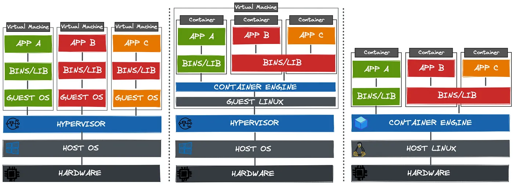
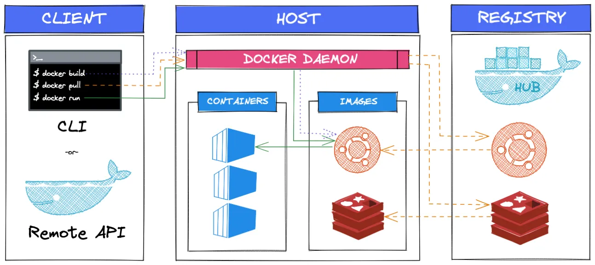
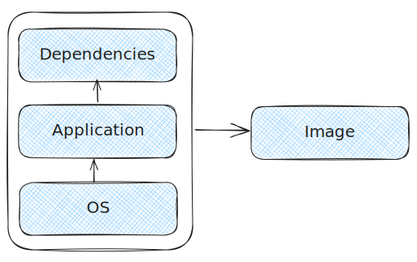

# Lesson 16: Docker Intro

## Docker VS VM



**Virtualization** is the process of running a virtual instance of a computer system in a layer abstracted from the
hardware system. It enables to running multiple operating systems on a computer at the same time by Virtual Machines.

**Virtual Machines (VMs)** are an abstraction of physical hardware that turns one server into many. VM allows multiple
VMs to run on a single machine. Each VM includes a full same of an operating system, the application, and necessary
binaries and libraries and all dependencies. VMs are not the best way to keep cost down and avoid waste hardware
resources since each VM needs to be managed and configured. By this reason, migration from virtualization to container
technologies is increasing day by day.

**Container technologies** allow developers to run multiple microservices on the same machine while not prepare a
different environment to each service. Also, make them isolated them from each other by using containers.

## Docker High-level Architecture



1. Develop your app
2. Build the app and dependencies into an image
3. Ship the image to a registry (optional)
4. Run it as a container

## Images

At a high level, an image is a collection of layers that comprise the application and all dependencies.



The most common way to build an image is with a Dockerfile and the docker tell docker build command. The Dockerfile is a
list of instructions that build how to build the image.

```dockerfile
# Start from base OS
FROM golang:1.23-alpine
# Copy app and dependencies
COPY go.mod go.sum ./
# Install dependencies
RUN go mod download
# How to start the app
ENTRYPOINT [ "/bin/server" ]
```

```shell
$ docker build -t my-image . -f Dockerfile
```

## Docker Register

Is a registry that stores container images. [Docker Hub](https://hub.docker.com/) is a public registry that anyone can
use, and Docker is configured to look for images on Docker Hub by default.

## Containers

Containers are run-time instances of images, and you can start one or more containers from a single image.

Containers isolate software from its environment and ensure that it works uniformly despite differences for instance
between development and staging.

Containers are also designed to be immutable. This means you shouldn’t change them after you’ve deployed them — if a
container fails, you replace it with a new one instead of connecting to it and making the fix in the live instance.

Containers should only run a single process and we use them to build microservices apps. For example, an application
with four features (microservices), such as a web server, auth, catalog, and store, will have four containers — one
running the web server, one running the auth service, one running the catalog, and another running the store.

## Commands

You don't need to learn all commands, but you can access basic [cheatsheet](./docker_cheatsheet.pdf) in current folder.
