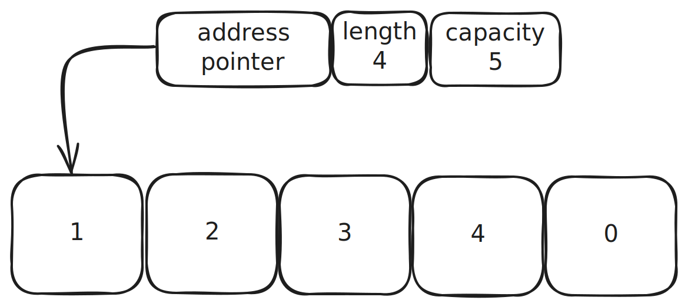

# Lesson 5: Composite Types

## var vs :=

```go
package main

var i = 10
var j = 3
var x, y = 10, 20

var (
	x    int
	y    = 20
	z    = 30
	d, e = 40, "hello"
	f, g string
)

func main() {
	var name string
	x, y := 10, "hello"
}
```

Go requirement is that _every declared local variable must be read_. It is a _compile-time error_ to declare a local
variable and to not read its value.

## Arrays and Slices

### Arrays

Arrays are rarely used directly in Go. All elements in the array must be of the type that’s specified. There are a few
declaration styles. In the first, you specify the size of the array and the type of the elements in the array:

```go
package main

func main() {
	arr1 := [3]int{10, 20, 30}
	arr2 := [12]int{1, 5: 4, 6, 10: 100, 15} // [1, 0, 0, 0, 0, 4, 6, 0, 0, 0, 100, 15]
	arr3 := [...]int{10, 20, 30}             // [10, 20, 30]
}
```

Arrays are equal if they are the _same length_ and _contain equal values_:

```go
package main

import (
	"fmt"
)

func main() {
	arr1 := [...]int{1, 2, 3}
	arr2 := [3]int{1, 2, 3}
	fmt.Println(arr1 == arr2) // prints true
}
```

#### read, write and length

```go
package main

import (
	"fmt"
)

func main() {
	arr := [...]int{1, 2, 3}
	arr[0] = 5
	fmt.Println(arr[1])   // prints 2
	fmt.Println(len(arr)) // prints 3
}
```

#### multidimensional arrays

```go
package main

import (
	"fmt"
)

func main() {
	var multiArr [2][3]int
	fmt.Println(multiArr) // prints [[0 0 0] [0 0 0]]
}
```

### Slices

Slices so useful is that you can grow slices as needed. This is because the length of a slice is not part of its type.
This removes the biggest limitations of arrays and allows you to write a single function that processes slices of
any size

```go
package main

import (
	"fmt"
)

func main() {
	slc := []int{1, 5: 4, 6, 10: 100, 15} // [1 0 0 0 0 4 6 0 0 0 100 15]
}
```

Slices can be compared with `slices.Equal` or `slices.EqualFunc`. But can be compared with nil.

```go
package main

import (
	"fmt"
	"slices"
)

func main() {
	x := []int{1, 2, 3, 4, 5}
	y := []int{1, 2, 3, 4, 5}
	z := []int{1, 2, 3, 4, 5, 6}
	s := []string{"a", "b", "c"}
	fmt.Println(x == nil)           // prints false
	fmt.Println(x == y)             // does not compile
	fmt.Println(slices.Equal(x, y)) // prints true 
	fmt.Println(slices.Equal(x, z)) // prints false
	fmt.Println(slices.Equal(x, s)) // does not compile
}
```

#### read, write and length

```go
package main

import (
	"fmt"
)

func main() {
	slc := []int{1, 2, 3}
	slc[0] = 5
	fmt.Println(slc[1])   // prints 2
	fmt.Println(len(slc)) // prints 3
}
```

#### multidimensional arrays

```go
package main

import (
	"fmt"
)

func main() {
	var multiSlc [][]int
	fmt.Println(multiSlc) // prints []
}
```

#### append

The built-in append function is used to grow slices:

```go
package main

func main() {
	slc := []int{1, 2, 3}
	slc = append(slc, 4)       // [1, 2, 3, 4]
	slc = append(slc, 5, 6, 7) // [1, 2, 3, 4, 5, 6, 7]
}
```

#### make and capacity

Slice can be declared via `make`, where initial `length` and `capacity` can be set. `make(type, length, capacity)`

```go
package main

import (
	"fmt"
)

func main() {
	slc := make([]int, 3, 5)
	slc[0] = 1
	slc[1] = 2
	slc[2] = 3
	fmt.Println(len(slc)) // 3
	fmt.Println(cap(slc)) // 5

	// slc[3] = 4 // panic: runtime error: index out of range [3] with length 3
}
```


```go
package main

import (
	"fmt"
)

func main() {
	slc := make([]int, 3, 5)
	slc[0] = 1
	slc[1] = 2
	slc[2] = 3
	fmt.Println(len(slc)) // 3
	fmt.Println(cap(slc)) // 5

	slc = append(slc, 4)
	fmt.Println(len(slc)) // 4
	fmt.Println(cap(slc)) // 5
}
```



```go
package main

import (
	"fmt"
)

func main() {
	slc := make([]int, 3, 5)
	slc[0] = 1
	slc[1] = 2
	slc[2] = 3
	fmt.Println(len(slc)) // 3
	fmt.Println(cap(slc)) // 5

	slc = append(slc, 4)
	fmt.Println(len(slc)) // 4
	fmt.Println(cap(slc)) // 5

	slc = append(slc, 5, 6, 7)
	fmt.Println(len(slc)) // 7
	fmt.Println(cap(slc)) // 10
}
```


#### slice a slice

```go
package main

import (
	"fmt"
)

func main() {
	x := []string{"a", "b", "c", "d"}
	y := x[:2]
	z := x[1:]
	d := x[1:3]
	e := x[:]
	fmt.Println(x) // [a b c d]
	fmt.Println(y) // [a b]
	fmt.Println(z) // [b c d]
	fmt.Println(d) // [b c]
	fmt.Println(e) // [a b c d]
}
```

to optimize memory it does not create "new slice":

```go
package main

import (
	"fmt"
)

func main() {
	slc := make([]int, 3, 5)
	slc[0] = 1
	slc[1] = 2
	slc[2] = 3
	slc = append(slc, 4, 5, 6, 7)
	fmt.Println(len(slc)) // 7
	fmt.Println(cap(slc)) // 10

	slc2 := slc[2:]
	fmt.Println(len(slc2)) // 5
	fmt.Println(cap(slc2)) // 8
}
```


```go
package main

import (
	"fmt"
)

func main() {
	slc := make([]int, 3, 5)
	slc[0] = 1
	slc[1] = 2
	slc[2] = 3
	slc = append(slc, 4, 5, 6, 7)
	fmt.Println(len(slc)) // 7
	fmt.Println(cap(slc)) // 10

	slc2 := slc[2:]
	fmt.Println(len(slc2)) // 5
	fmt.Println(cap(slc2)) // 8

	slc2[2] = -1
	fmt.Println(slc)  // [1 2 3 4 -1 6 7]
	fmt.Println(slc2) // [3 4 -1 6 7]
}
```

#### copy and clear

But slices can be copied with `copy` and cleared with `clear`:

```go
package main

import (
	"fmt"
)

func main() {
	slc1 := []int{1, 2, 3, 4}
	slc2 := make([]int, 2)      // only two items could be copied
	num := copy(slc2, slc1[:3]) // returns num of items were copied

	fmt.Println(num, slc2) // 2 [1 2]

	clear(slc2)
	fmt.Println(slc2, len(slc2)) // [0 0] 2
}
```

**Advanced**: slices are implemented as a struct. With 3 fields:

```go
package main

type slice struct {
	len int
	cap int
	p   *[]
}
```

## Maps

Maps in go basically `hash map` or `has table`.

- Maps automatically grow as you add key-value pairs to them.
- The zero value for a map is **nil**.
- Maps are not comparable. You can check if they are equal to nil, but you cannot
  check if two maps have identical keys and values using == or differ using !=.

Basic operations.

- Construct `m := map[key]value{}`
- Insert:   `m[k] = v`
- Lookup:    `v, ok = m[k]`
- Delete:    `delete(m, k)`
- Empty:    `clear(m)`
- Iterate:    `for k, v := range m`
- Size:        `len(m)`
- Comparing `maps.Equal(m, n)` - Please refer to maps package.

```go
package main

import (
	"fmt"
)

func main() {
	totalWins := map[string]int{}
	totalWins["Orcas"] = 1
	totalWins["Lions"] = 2
	fmt.Println(totalWins["Orcas"])   // 1
	fmt.Println(totalWins["Kittens"]) // 0
	totalWins["Kittens"]++
	fmt.Println(totalWins["Kittens"]) // 1
	totalWins["Lions"] = 3
	fmt.Println(totalWins["Lions"]) // 3
}
```

#### Recipe: Sets

Set is data structure with O(1) write and lookup. Only has a values.

First lets take a look to `ok` of a map lookup:

```go
package main

import (
	"fmt"
)

func main() {
	m := map[string]int{
		"hello": 5,
		"world": 0,
	}
	v, ok := m["hello"]
	fmt.Println(v, ok) // 5, true
	v, ok = m["world"]
	fmt.Println(v, ok) // 0, true
	v, ok = m["goodbye"]
	fmt.Println(v, ok) // 0, false
}
```

Now using `struct` (will see later) we can implement set

```go
package main

import (
	"fmt"
)

func main() {
	intSet := map[int]struct{}{}
	vals := []int{5, 10, 2, 5, 8, 7, 3, 9, 1, 2, 10}
	for _, v := range vals {
		intSet[v] = struct{}{}
	}
	if _, ok := intSet[5]; ok {
		fmt.Println("5 is in the set")
	}
}
```

Why not use `map[int]bool{}`. The empty `struct` has 0 bytes, `bool` - 1 byte.

### Hash collisions

Please look to https://www.youtube.com/watch?v=FsfRsGFHuv4 (Till 5:30)

**Advanced**: maps are implemented as a pointer a struct.

## Pointer

A _pointer_ is a variable that holds the location in memory where a value is stored.

```go
package main

func main() {
	x := 10
	y := true
	pX := &x
	pY := &y
	var pZ *string
}
```


You can also work with underline value.

```go
package main

import (
	"fmt"
)

func main() {
	a := 10
	pA := &a
	fmt.Println(pA)  // prints a memory address 
	fmt.Println(*pA) // prints 10
	b := 5 + *pA
	fmt.Println(b) // prints 15

	c := new(int)
	fmt.Println(c == nil) // prints false 
	fmt.Println(*c)       // prints 0
}
```

Don't forget that pointers might be `nil`

```go
package main

import (
	"fmt"
)

func main() {
	var pA *int
	fmt.Println(pA == nil) // prints true 
	// fmt.Println(*pA) // panics
}
```

You can’t use an `&` before a primitive literal (numbers, booleans, and strings) or a constant because they don’t
have memory addresses; they exist only at compile time.

```go
package main

import (
	"fmt"
)

type person struct {
	FirstName  string
	MiddleName *string
	LastName   string
}

func main() {
	p := person{
		FirstName: "Dwight",
		// MiddleName: &"Kurt", // This line won't compile
		MiddleName: makePointer("Kurt"),
		LastName:   "Schrute",
	}
	fmt.Println(p)
}

func makePointer[T any](t T) *T {
	return &t
}
```

Go is a call-by-value language, the values passed to functions are copies. For nonpointer types like primitives,
structs, and arrays, this means that the called function cannot modify the original. However, if a pointer is passed
to a function, the function gets a copy of the pointer. This still points to the original data, which means that the
original data can be modified by the called function.

```go
package main

import (
	"fmt"
)

func failedUpdate(pa *int) {
	b := 20
	pa = &b
}

func update(pa *int) {
	*pa = 20
}

func main() {
	a := 10
	failedUpdate(&a)
	fmt.Println(a) // prints 10
	update(&a)
	fmt.Println(a) // prints 20
}
```

But try to keep your code immutable.

> Immutable types are safer from bugs, easier to understand, and more ready for change. Mutability makes it harder to
> understand what your program is doing, and much harder to enforce contracts.”

## Exercises

### Exercise 1

Write a program that defines a slice `simpsons` of strings with the following values: "Homer", "Marge", "Bart", "Liza",
and "Maggy". Create a subslice `parents` containing the first two values and a second subslice `children` with the
third, fourth and fifth values. Print out all slices.

### Exercise 2

Then try to update "Bart" to "Seymour Butz" in `simpsons`. What do you expect? Print out all slices.

### Exercise 3

Append to a `simpsons` slice "Abe". What do you expect? Print out all slices.

Revert back. Append to a `parents` slice "Abe". What do you expect? Print out all slices.

### Exercise 4

Write a program that defines a map variable called `greetings` with the values `en -> 'Hello'`, `es -> 'Hola'`,
`id -> 'Halo'`

Add new `sw -> 'Jambo'`

Remove English version altogether.

### Exercise 5

Create function `addArabic` which should accept the `greetings` map and add Arabic `ar -> مرحبا`

Create function `addChinese` which should accept the pointer to the `greetings` map and add Chinese `zh -> '你好'`

Print the original `greetings` map. What do you expect?
