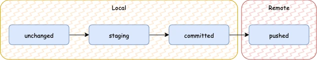

# Lesson 7: Git && Composition

## Git

Git is a free and open-source version control system, originally created by Linus Torvalds in 2005. Unlike older
centralized version control systems such as SVN and CVS, **Git is distributed**: every developer has the full history of
their code repository locally. This makes the initial clone of the repository slower, but subsequent operations such as
commit, blame, diff, merge, and log dramatically faster.

[Cheat Sheet](https://www.atlassian.com/git/tutorials/atlassian-git-cheatsheet)

### Files

- ignored - git never even looks at it
- untracked - git reports its presence but doesn’t track its changes
- tracked - git tracks everything that happens to it
    - changed
    - staged
    - committed
    - pushed

### Workflow



## Struct

It is a probably main data type which most Go's complex data types consist of.
When you have related data that you want to group together, you should define a struct.

```go
package main

import (
	"fmt"
)

type character struct {
	name       string
	age        int
	occupation string
}

func main() {
	fry := character{
		name:       "Philip J. Fry",
		age:        28,
		occupation: "delivery boy",
	}
	leela := &character{
		name:       "Turanga Leela",
		age:        25,
		occupation: "spaceship capitan",
	}
	bender := character{
		name:       "Bender Bending Rodríguez",
		age:        4,
		occupation: "worker",
	}
	bender.occupation = "chef"
}
```

## Methods

```go
type character struct {
name       string
age        int
occupation string
}

func (c character) info() {
fmt.Printf("name: %s, age: %d, occupation: %s\n", c.name, c.age, c.occupation)
}

func main() {
...

fry.info()
leela.info()
bender.info()
}
```

```shell
$ go run ./...
name: Philip J. Fry, age: 28, occupation: delivery boy
name: Turanga Leela, age: 25, occupation: spaceship capitan
name: Bender Bending Rodríguez, age: 4, occupation: chef
```

### Pointer Receivers and Value Receivers

> - If the receiver is a map, func or chan, don’t use a **pointer** to them.
    > If the receiver is a slice and the method doesn’t reslice or reallocate the slice, don’t use a **pointer** to it.
> - If the method needs to mutate the receiver, the receiver must be a **pointer**.
> - If the receiver is a **struct** that contains a sync.Mutex or similar synchronizing field,
    > the receiver must be a **pointer** to avoid copying.
> - If the receiver is a large struct or array, a **pointer** receiver is more efficient. How large is large?
    > Assume it’s equivalent to passing all its elements as arguments to the method. If that feels too large, it’s also
    too large for the receiver.
> - Can function or methods, either concurrently or when called from this method, be mutating the receiver?
    > A value type creates a copy of the receiver when the method is invoked,
    > so outside updates will not be applied to this receiver. If changes must be visible in the original receiver,
    > the receiver must be a **pointer**.
> - If the receiver is a struct,
    > array or slice and any of its elements is a **pointer** to something that might be mutating,
    > prefer a **pointer** receiver, as it will make the intention clearer to the reader.
> - If the receiver is a small array or struct that is naturally a value type
    > (for instance, something like the time.Time type), with no mutable fields and no **pointers**,
    > or is just a simple basic type such as int or string, a value receiver makes sense.
    > A value receiver can reduce the amount of garbage that can be generated;
    > if a value is passed to a value method, an on-stack copy can be used instead of allocating on the heap.
    > (The compiler tries to be smart about avoiding this allocation, but it can’t always succeed.)
    > Don’t choose a value receiver type for this reason without profiling first.
> - Don’t mix receiver types. Choose either **pointers** or **struct types** for all available methods.
> - Finally, when in doubt, use a **pointer** receiver.

https://go.dev/wiki/CodeReviewComments

```go
package main

import (
	"fmt"
)

type character struct {
	name       string
	age        int
	occupation string
}

func (c character) info() {
	fmt.Printf("name: %s, age: %d, occupation: %s\n", c.name, c.age, c.occupation)
}

func (c character) setOccupationByValue(occupation string) {
	c.occupation = occupation
}

func (c *character) setOccupationByPointer(occupation string) {
	c.occupation = occupation
}

func main() {
	bender := character{
		name:       "Bender Bending Rodríguez",
		age:        4,
		occupation: "worker",
	}

	bender.info()
	bender.setOccupationByValue("chef")
	bender.info()
	bender.setOccupationByPointer("chef")
	bender.info()
}
```

```go
$ go run./...
name: Bender Bending Rodríguez, age: 4, occupation: worker
name: Bender Bending Rodríguez, age: 4, occupation: worker
name: Bender Bending Rodríguez, age: 4, occupation: chef
```

Struct character has methods on both value and pointer receivers.
Such usage is not recommended by the [Go Documentation](https://go.dev/doc/faq#methods_on_values_or_pointers).

## Composition

> Favor object composition over class inheritance

```go
package main

import (
	"fmt"
)

type character struct {
	name       string
	age        int
	occupation string
}

type trademark struct {
	*character
	owner string
}

func (c *character) info() {
	fmt.Printf("name: %s, age: %d, occupation: %s\n", c.name, c.age, c.occupation)
}

func main() {
	bender := &character{
		name:       "Bender Bending Rodríguez",
		age:        4,
		occupation: "worker",
	}

	benderTrademark := &trademark{
		character: bender,
		owner:     "Disney",
	}

	fmt.Println(benderTrademark.name)
	benderTrademark.info()
	fmt.Println(benderTrademark.owner)
}
```

```shell
$ go run ./...
Bender Bending Rodríguez
name: Bender Bending Rodríguez, age: 4, occupation: worker
Disney
```

What will happen if parent will have same field.

```go
package main

import (
	"fmt"
)

type character struct {
	name       string
	age        int
	occupation string
}

type trademark struct {
	*character
	name  string
	owner string
}

func (c *character) info() {
	fmt.Printf("name: %s, age: %d, occupation: %s\n", c.name, c.age, c.occupation)
}

func main() {
	bender := &character{
		name:       "Bender Bending Rodríguez",
		age:        4,
		occupation: "worker",
	}

	benderTrademark := &trademark{
		character: bender,
		name:      "Bender Trademark",
		owner:     "Disney",
	}

	fmt.Println(benderTrademark.name)
	fmt.Println(benderTrademark.character.name)
	benderTrademark.info()
	fmt.Println(benderTrademark.owner)

	benderTrademark.character.name = "Bender Character"
	benderTrademark.info()
}
```

```shell
$ go run ./...
Bender Trademark
Bender Bending Rodríguez
name: Bender Bending Rodríguez, age: 4, occupation: worker
Disney
name: Bender Character, age: 4, occupation: worker
```

## Interface

In Go, an interface is a set of method signatures.
When a type provides definition for all the methods in the interface, it is said to implement the interface.

```go
package main

import (
	"fmt"
)

type informer interface {
	info() string
}

type futuramaCharacter struct {
	name string
	age  int
}

func (f *futuramaCharacter) info() string {
	return fmt.Sprintf("name: %s, age: %d", f.name, f.age)
}

type officeCharacter struct {
	name       string
	occupation string
}

func (o *officeCharacter) info() string {
	return fmt.Sprintf("name: %s, occupation: %s", o.name, o.occupation)
}

func main() {
	callInformers(
		[]informer{
			&futuramaCharacter{"Bender Bending Rodríguez", 4},
			&officeCharacter{"Michael Scott", "regional manager"},
			&officeCharacter{"Dwight Schrute", "assistant to the regional manager"},
		},
	)
}

func callInformers(infs []informer) {
	for _, inf := range infs {
		fmt.Println(inf.info())
	}
}
```

```shell
$ go run ./...
name: Bender Bending Rodríguez, age: 4
name: Michael Scott, occupation: regional manager
name: Dwight Schrute, occupation: assistant to the regional manager
```

### empty interface

An interface that has zero methods is called an empty interface. It is represented as `interface{}`.
Since the empty interface has zero methods, **all types** implement the empty interface.

```go
package main

import (
	"fmt"
)

func describe(i interface{}) {
	fmt.Printf("Type = %T, value = %v\n", i, i)
}

func main() {
	s := "Hello World"
	describe(s)
	i := 55
	describe(i)
	strt := struct {
		name string
	}{
		name: "Naveen R",
	}
	describe(strt)
}
```

Type assertion is used to extract the underlying value of the interface.

```go
package main

import (
	"fmt"
)

func assert(i interface{}) {
	v := i.(int)
	fmt.Println(v)
}

func main() {
	var i interface{} = 56
	assert(i) // get the underlying int value from i

	var s interface{} = "Steven Paul"
	assert(s) // panic: interface conversion: interface {} is string, not int.
}
```

To fix panic you can use `v, ok` structure, which will not panic.

```go
package main

import (
	"fmt"
)

func assert(i interface{}) {
	v, ok := i.(int)
	fmt.Println(v, ok)
}

func main() {
	var i interface{} = 56
	assert(i) // 56 true

	var s interface{} = "Steven Paul"
	assert(s) // 0 false
}
```

Or you can use `switch`.

```go
package main

import (
	"fmt"
)

func assert(i interface{}) {
	switch i.(type) {
	case string:
		fmt.Printf("I am a string and my value is %s\n", i.(string))
	case int:
		fmt.Printf("I am an int and my value is %d\n", i.(int))
	default:
		fmt.Printf("Unknown type\n")
	}
}

func main() {
	var i interface{} = 56
	assert(i)

	var s interface{} = "Steven Paul"
	assert(s)
}
```

### Internals

An interface can be thought of as being represented internally by a tuple `(type, value).type`
is the underlying concrete type of the interface and value holds the value of the concrete type.

```go
package main

import (
	"fmt"
)

type Worker interface {
	Work()
}

type Person struct {
	name string
}

func (p *Person) Work() {
	fmt.Println(p.name, "is working")
}

func describe(w Worker) {
	fmt.Printf("Interface type %T value %v\n", w, w)
}

func main() {
	p := &Person{
		name: "Naveen",
	}
	var w Worker = p
	describe(w)
	w.Work()
}
```

### Accept Interfaces, Return Structs

It means that the business logic invoked by your functions should be invoked via interfaces,
but the output of your functions should be a concrete type.

## Exercises

### Exercise 1

Write a struct `Family` which should have fields

- `Name`
- `NumberOfMembers`
- `Assets` which is by itself also a struct with fields
    - `NumberOfCars`,
    - `NumberOfAssets`.

Make sure to supply **constructor function**. Create two families `simpsons` and `smiths` (Rick & Morty).

### Exercise 2

Create `Game` struct with field

- `Teams`

and implement methods:

- `AddTeam` which should add a team
- `Announce` which should announces `Today we have {numberOfTeams} team(s): {team1}, {team2}...`

Make sure to supply **constructor function**. Create a new game `quiz`. Add `simpsons` and `smiths` to `quiz`.

### Exercise 3

Create new struct `Company` with fields

- `Name`
- `NumberOfEmployees`
- `Industry`

Create a company `dunderMifflin`. And try to add to a quiz. Make any appropriate changes.
